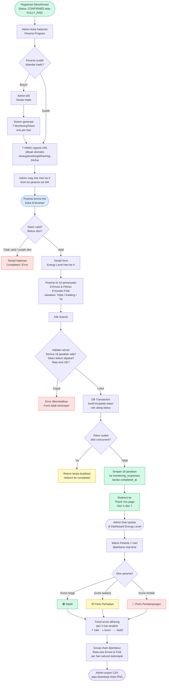
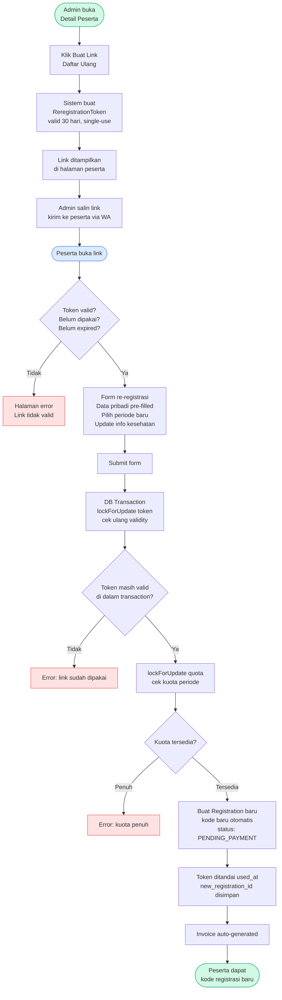

# Rumah Sehat Holistik Satu Bumi
## Digital Management System — Executive Overview

---

## What This System Is

The RSH Satu Bumi Digital Management System is the central operational platform for running Rumah Sehat Holistik Satu Bumi's programs. It handles everything from the moment a prospective participant finds us online, through registration and payment, program attendance, daily energy tracking, and follow-up CRM — all in one integrated system.

It replaces manual processes (spreadsheets, paper forms, WhatsApp confirmations) with a structured, trackable digital workflow that reduces administrative burden and ensures nothing falls through the cracks.

---

## Who Uses It

| Role | What They Do in the System |
|---|---|
| **Prospective Participants** | Browse program information, fill out the registration form online |
| **Participants (active)** | Fill daily Energy Level forms via personal link sent by admin |
| **CS / Admin Staff** | Review registrations, manage payments, contact database, send re-registration links |
| **Program Managers** | Set up program schedules, track attendance, monitor energy levels per participant |
| **Management / C-Suite** | View dashboard reports, monitor revenue and registration trends |

---

## The Participant Journey — How It Works

### Step 1 — Registration (Public, Online)
A prospective participant visits the website and fills out an online registration form. The form captures:
- Personal information (name, date of birth, occupation, contact)
- Health background (complaints, current medications, allergies, treatment history)
- Emotional and physical self-assessment
- Program period selection (based on available schedules)

The form saves progress automatically — participants can close the browser and return later without losing their answers. Before final submission, a confirmation screen summarizes their choices so they can review before sending.

Once submitted, the participant receives a unique **registration code** they can use to check their status at any time.

### Step 2 — Admin Review
The admin team receives a notification and can immediately review the full registration in the admin panel. Each registration shows:
- Complete participant profile and health information
- BMI indicator with health category badge (Underweight / Normal / Overweight / Obese)
- Assigned program period and current enrollment count
- Full submission history

### Step 3 — Status Management
The admin updates the registration status as the participant progresses:

| Status | Meaning |
|---|---|
| **Pending Payment** | Registration received, awaiting initial payment |
| **DP / Confirmed** | Down payment received, spot confirmed |
| **Fully Paid** | Complete payment received |
| **Cancelled** | Registration cancelled |

Each status change is tracked, and the system enforces a logical progression — it is not possible to accidentally skip steps or set an invalid status.

### Step 4 — Invoice & Payment
When a registration is confirmed, the system **automatically generates an invoice**. Invoices handle two payment scenarios:

- **Full Payment** — Standard invoice for the complete program fee
- **Down Payment (DP)** — Invoice showing the DP amount due, with the remaining balance clearly displayed in a highlighted summary box

Invoices can be downloaded as a professionally formatted **PDF** at any time, including the organization's logo, payment bank details, and program information. They can also be re-issued or adjusted if needed.

### Step 5 — Attendance & Energy Level Monitoring (NEW)
Once a participant arrives at the program, the admin marks them as **Hadir (Present)**. This triggers:
1. Seven unique, tamper-proof links are generated — one for each program day
2. Each link is sent to the participant via WhatsApp
3. Each day, the participant opens their link and fills in a short 16-question form (8 Emosi / Pikiran + 8 Kondisi Fisik)
4. Responses are scored and color-coded: 🟢 Stabil · 🟡 Perlu Perhatian · 🔴 Perlu Pendampingan
5. The admin dashboard shows a live matrix of all participants vs. all 7 days — including trend arrows

### Step 6 — Re-Registration (NEW)
Participants who wish to attend another program period can be sent a **re-registration link** by the admin:
1. Admin opens the participant's profile and clicks "Buat Link Daftar Ulang"
2. A secure, single-use link (valid 30 days) is generated and copied
3. Admin sends it to the participant via WhatsApp
4. The participant opens the link, selects a new program period, and updates their health information
5. A new registration is created automatically — the original record is preserved

---

## Key Capabilities

### Program Schedule Management
The admin team can create, edit, and manage program periods with:
- Start and end dates (3-day, 7-day, or custom duration)
- Enrollment quota (maximum participants)
- Full price and down payment amount
- Active / inactive toggle

The system tracks available spots in real time. When a program reaches capacity, it stops accepting registrations.

---

### Peserta Program — Attendance & Progress Tracking (NEW)
The **Peserta Program** module gives admins a full view of all confirmed/paid participants across all periods:

- Filter by period, attendance status, or search by name
- One-click **Tandai Hadir** button with confirmation prompt — automatically generates 7 Energy Level links
- Progress bar showing how many of 7 daily forms have been completed
- Detail page per participant with: profile, program period, all 7 daily links with copy buttons, score per day, trend chart
- Admin can reset any day's responses to allow the participant to re-fill

---

### Energy Level Monitoring Dashboard (NEW)
A dedicated dashboard for program staff shows the health status of the entire group:

- **Summary cards**: Total hadir · Stabil (🟢) · Perlu Perhatian (🟡) · Perlu Pendampingan (🔴)
- **Alert banner**: Highlights how many participants need immediate attention
- **Matrix table**: All participants vs. all 7 days — color-coded emoji cells with hover tooltips showing exact Emosi and Fisik scores
- **Trend arrows**: Per-participant trend (↗️ improving · ↘️ declining · → stable) based on last 2 completed days
- **Group trend chart**: Average Emosi and Fisik scores across all participants per day, downloadable as PNG
- **CSV export** of all responses for a selected period

---

### Contact Database / CRM (NEW)
A dedicated CRM module for the CS (Customer Service) team to manage prospective participants who have not yet registered:

- **Import via CSV** — bulk upload from Excel files (auto-detects separator, handles BOM, fixes scientific notation phone numbers, max 5,000 rows per import)
- **Manual entry** — add individual contacts with name, phone, email, health complaint, source, gender, age, notes
- **Filters**: search by name/phone/email, filter by complaint type, source, or "belum dihubungi" (not yet contacted)
- **One-click WA/Email**: opens WhatsApp or email client and automatically logs the contact event with timestamp
- **Bulk actions**: edit a column value or delete across multiple selected contacts simultaneously
- **History & Undo**: every import or bulk operation is saved as a snapshot. Admin can view history and restore a previous state (last 3 snapshots)

---

### Re-Registration Flow (NEW)
For participants repeating the program:
- Admin generates a single-use secure link from the participant's profile
- Link expires in 30 days; once used, it cannot be reused
- The re-registration form pre-fills all personal data from the original registration; only health updates and period selection are required
- Upon submission, a new registration record is created automatically with a new code
- The original registration is preserved with a reference to the new one

---

### Invoicing & Billing
The system maintains a complete invoice record for every transaction. Key features include:
- Auto-generated invoice numbers
- Support for full payment or down payment billing
- PDF download with professional layout
- Payment status tracking (Unpaid / Paid / Cancelled)
- A product/service catalog that speeds up invoice creation for recurring items

---

### Content & Articles
The website's articles and blog posts are managed entirely within the system. Staff can:
- Write and publish articles with a rich text editor
- Upload cover images
- Organize content by category
- Use an **AI writing assistant** to generate a first draft from a topic prompt (powered by the team's AI provider of choice — Google Gemini, OpenRouter, or others)

Published articles appear on the public-facing website automatically.

---

### Reporting & Dashboard
**Live Dashboard** — The admin home screen shows at a glance:
- Total registrations broken down by status
- Active program periods and their current enrollment vs. quota
- The 5 most recent registrations with status badges
- A **6-month trend chart** tracking registration volume and revenue month by month
- A **status breakdown donut chart** showing the proportion of pending, confirmed, paid, and cancelled registrations

**Data Export** — Any list in the system (registrations, invoices, energy level responses) can be exported to a **CSV file** compatible with Microsoft Excel.

---

### Security & Access Control
- The admin panel is accessed through a discreet, non-obvious URL (not the standard `/admin` path)
- Attempting to access admin pages without being logged in shows a generic "page not found" — it does not reveal that an admin panel exists
- Sessions automatically expire after **30 minutes of inactivity**
- Two staff roles: **Admin** (full access) and **Staff** (limited access)
- All activity is logged and viewable in the system's audit log
- Energy Level links use **HMAC-signed URLs** (24-character signature) — links cannot be guessed or forged
- Re-registration tokens are **single-use with database-level locking** — prevents double-submission even under concurrent requests
- CSV imports are **rate-limited to 5,000 rows** to prevent server overload

---

### Google Sheets Integration
Registration data is automatically mirrored to a connected Google Sheets document, giving management a familiar spreadsheet view of participant records without manual data entry.

---

## Summary of Benefits

| Before | After |
|---|---|
| Registration via WhatsApp or paper form | Structured online form with health assessment |
| Manual invoice in Word/Excel | Auto-generated PDF invoices, tracked per participant |
| Status tracked in a spreadsheet | Real-time status board with audit trail |
| Revenue figures compiled manually | Live dashboard with monthly charts |
| Separate tools for articles, billing, scheduling | Single integrated platform |
| No visibility into capacity | Real-time quota tracking per program period |
| Daily health check by paper or verbal | Digital daily Energy Level form per participant |
| No CRM — contacts managed in WhatsApp | Structured contact database with history, import, and WA logging |
| Re-registration done manually via new form | Secure token link, auto-creates new registration |

---

## System Access

The system is hosted at **rshsatubumi.id** and is accessible from any browser — no installation required.

- **Public website & registration:** `rshsatubumi.id`
- **Admin panel:** Accessible to authorized staff only (credentials provided separately)
- **Check registration status (for participants):** `rshsatubumi.id/daftar/cek`
- **Energy Level form (per participant, per day):** `rshsatubumi.id/energylevel/{id}/{day}/{signature}`

---

## Energy Level Feature — Complete Flow Diagram

---

## Re-Registration Flow Diagram

---

*Document version: June 2026. Updated to reflect Energy Level Monitoring, Contact Database CRM, Re-Registration, and Peserta Management features.*
